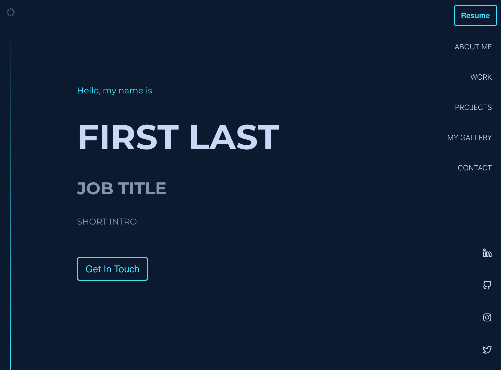
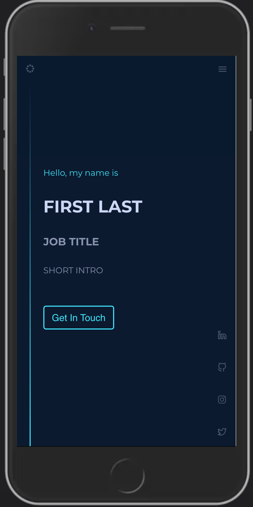
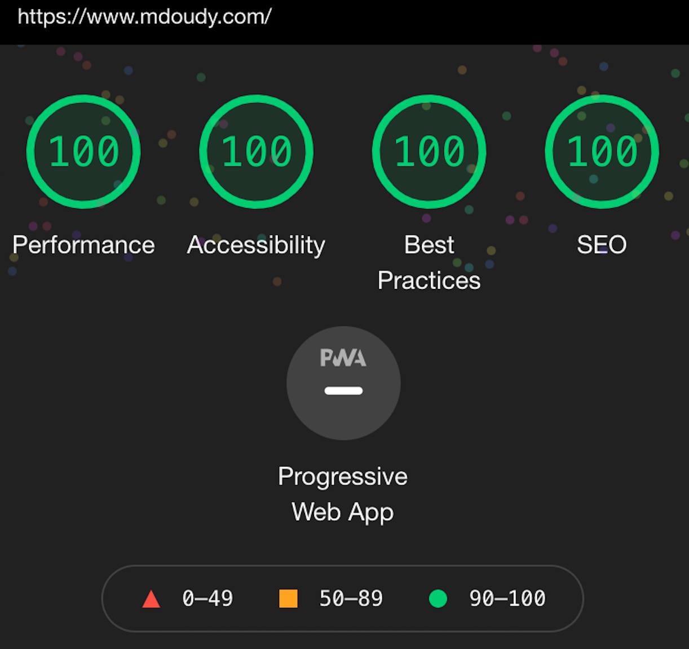

# Better Portfolio Website Builder

## Live version - [mdoudy.com](https://www.mdoudy.com/)

[Next.js](https://nextjs.org/) | [Vercel](https://vercel.com/) | [Redux Toolkit](https://redux-toolkit.js.org/) | [Sass](https://sass-lang.com/)

---

### 🚀 Simple to setup and deploy (all data goes into 1 json file)
### 🏎 Google lighthouse audit perfect score
### 📊 Google Analytics ready
### 🔎 SEO friendly
### 📱 Optimized for mobile and tablet
### 📋 Cross browser tested
### 🎨 Customizable color themes

<br>
<div align="center">
  <div style="display: flex; align-items: flex-start;">
    
    
    
  </div>
</div>
<br>

---

## Installation

> *Install Dependencies*

```sh
yarn
```

> *Start development server*

```sh
yarn run dev

# or to clear .next cache and run dev

yarn run no-cache-dev
```

---

## Adding your data
To populate the website with your data, navigate to `src/client/lib/data.json` and update each section accordingly. Sample data (capitalized) and images have been added to help.

To ensure images are served properly, place them in `public/images` and reference them like this: `/images/EXAMPLE.png`

#### data.json schema overview:

<details>
<summary>Settings</summary>
<br>

sideBarLocation available options: "left" or "right"

projectCards
- for projectCards alternating style, add projectCards section heading to showAlternatingCards array
- for less space between cards, add projectCards section heading to compactView array

```bash
"settings": {
  "sideBarLocation": "right",
  "projectCards": {
    "showAlternatingCards": ["WORK", "PROJECTS"],
    "compactView": ["PROJECTS"]
  }
}
```
</details>
<details>
<summary>Meta</summary>
<br>

Data used for SEO purposes

```bash
"meta": {
  "title": "META TITLE",
  "description": "META DESC",
  "mobileIcon": "/mobile-icon.png",
  "favIcon": "/favicon.ico",
  "language": "en-US",
  "canonical": "CANONICAL URL",
  "url": "URL",
  "twitterHandle": "TWITTER HANDLE"
}
```
</details>
<details>
<summary>Social</summary>
<br>

Used to show clickable social media icons in the sidebar. These are optional, so for the ones that are not needed, delete the corresponding lines.

```bash
"social": {
  "linkedin": "LINKEDIN URL",
  "github": "GITHUB URL",
  "instagram": "INSTAGRAM URL",
  "twitter": "TWITTER URL"
}
```
</details>
<details>
<summary>Document</summary>
<br>

Add a PDF version of your resume or other document to `public/docs` and add the corresponding path and desired file-name here.

```bash
"document": {
  "fileName": "MY-RESUME.pdf",
  "path": "/docs/temp.pdf"
}
```
</details>
<details>
<summary>Header</summary>
<br>
This displays the main header portion of the page. These are optional, so for the ones that are not needed, delete the corresponding lines. The ctaText is displayed in the button.

```bash
"header": {
  "preHeading": "Hello, my name is",
  "heading": "FIRST LAST",
  "subHeading": "JOB TITLE",
  "text": "SHORT INTRO",
  "ctaText": "Get In Touch"
}
```
</details>
<details>
<summary>Sections</summary>
<br>

Add the desired sections here using the format below.

The available types are `about`, `projectCards`, `gallery`, and `contact`. The headings of each will be used as the keys throughout the site, so these are required aand need to be unique.

Multiple instances of `projectCards` can be used, as long as the headings are unique.

These are all optional, so if a certain section is not needed, delete the corresponding lines.

```bash
"sections": [
  {
    "type": "about",
    "heading": "ABOUT ME"
  },
  {
    "type": "projectCards",
    "heading": "WORK"
  },
  {
    "type": "projectCards",
    "heading": "PROJECTS"
  },
  {
    "type": "gallery",
    "heading": "MY GALLERY"
  },
  {
    "type": "contact",
    "heading": "CONTACT"
  }
]
```
</details>
<details>
<summary>About</summary>
<br>

Fills the about section.

If html is needed rather than text for the content, replace the `content` key with `contentHtml`.

`image` is optional, so if not needed, delete the line.

```bash
"about": {
  "content": [
    "LOREM IPSUM DOLOR SIT AMET CONSECTETUR ADIPISICING ELIT.",
    "LOREM IPSUM DOLOR SIT AMET CONSECTETUR ADIPISICING ELIT."
  ],
  "image": "/images/about/TEMP-ME.png"
}
```
</details>
<details>
<summary>Project Cards</summary>
<br>

Fills each projectCards sections. Each projectCards section heading needs to be specified here with the desired corresponding data. In this example, the `WORK` and `PROJECTS` headings are used.

`title`, `description`, `tools`, `links`, `image`, and `highlights` are all optional, so if not needed, delete the corresponding lines.

`highlights` fills out the data used in the specified project's onClick popover.

If html is needed rather than text for the description, replace the `description` key with `descriptionHtml`.

```bash
"projectCards": {
  "WORK": [
    {
      "title": "WORK PROJECT 1",
      "description": "LOREM IPSUM DOLOR SIT AMET CONSECTETUR ADIPISICING ELIT.",
      "tools": ["TOOL 1", "TOOL 2"],
      "links": {
        "github": "GITHUB URL",
        "website": "WEBSITE URL"
      },
      "image": "/images/projectCards/TEMP-WORK-PROJECT-1-BANNER.png",
      "highlights": [
        {
          "heading": "POINT 1",
          "details": [
            "LOREM IPSUM DOLOR SIT AMET CONSECTETUR ADIPISICING ELIT.",
            "LOREM IPSUM DOLOR SIT AMET CONSECTETUR ADIPISICING ELIT."
          ],
          "media": "/images/projectCards/TEMP-WORK-PROJECT-1-POINT-1.gif"
        },
        {
          "heading": "POINT 2",
          "details": [
            "LOREM IPSUM DOLOR SIT AMET CONSECTETUR ADIPISICING ELIT."
          ]
        }
      ]
    },
    {
      "title": "WORK PROJECT 2",
      "description": "LOREM IPSUM DOLOR SIT AMET CONSECTETUR ADIPISICING ELIT."
    }
  ],
  "PROJECTS": [
    {
      "title": "PROJECT 1",
      "description": "LOREM IPSUM DOLOR SIT AMET CONSECTETUR ADIPISICING ELIT."
    }
  ]
}
```
</details>
<details>
<summary>Gallery</summary>
<br>

Fills out the gallery section of the site.

`thumbnail` is optional, but advised to reduce load time if images are too large.

```bash
"gallery": [
  {
    "image": "/images/gallery/TEMP-GALLERY-IMAGE.png",
    "thumbnail": "/images/gallery/TEMP-GALLERY-IMAGE-THUMBNAIL.png"
  },
  {
    "image": "/images/gallery/TEMP-GALLERY-IMAGE.png",
    "thumbnail": "/images/gallery/TEMP-GALLERY-IMAGE-THUMBNAIL.png"
  }
]
```
</details>
<details>
<summary>Contact</summary>
<br>

Fills out the contact section.

If html is needed rather than text, replace the `text` key with `textHtml`.

`ctaText` corresponds to the button text.

```bash
"contact": {
  "text": "LOREM IPSUM DOLOR SIT AMET CONSECTETUR ADIPISICING ELIT.",
  "ctaText": "Send Email",
  "email": "EMAIL@EMAIL.COM"
}
```
</details>

---

## Updating color themes
To customize the colors, navigate to `styles/utilities/_variables.scss` and update the following of each theme:

```bash
$theme-1-color-1: #ccd6f6; /* primary text */
$theme-1-color-2: #8892b0; /* secondary text */
$theme-1-color-3: #48e4ff; /* contrasting color */
$theme-1-color-4: #0b1a2f; /* primary background */
$theme-1-color-5: #122341; /* secondary background */
```

---

## Deploying

The easiest way to deploy is via [Vercel](https://vercel.com/), built by the same folks behind [Next.js](https://nextjs.org/).

If using Vercel:

> In Build & Development Settings, override the build command to `yarn run build` or your own command if updated.

To add Google Analytics capabilities:

> Add your GA Tracking ID as an environment variable under the name, `NEXT_PUBLIC_GA_ID`

For additional details and help, check out the [Next.js deployment documentation](https://nextjs.org/docs/deployment).

---

## Attributions
Design aspects inspired by [bchiang7](https://github.com/bchiang7/v4) and components I've built in [Helbiz](http://helbiz.com/).

---

## Questions?
Feel free to email me [here](mailto:michael.doudy@gmail.com).
